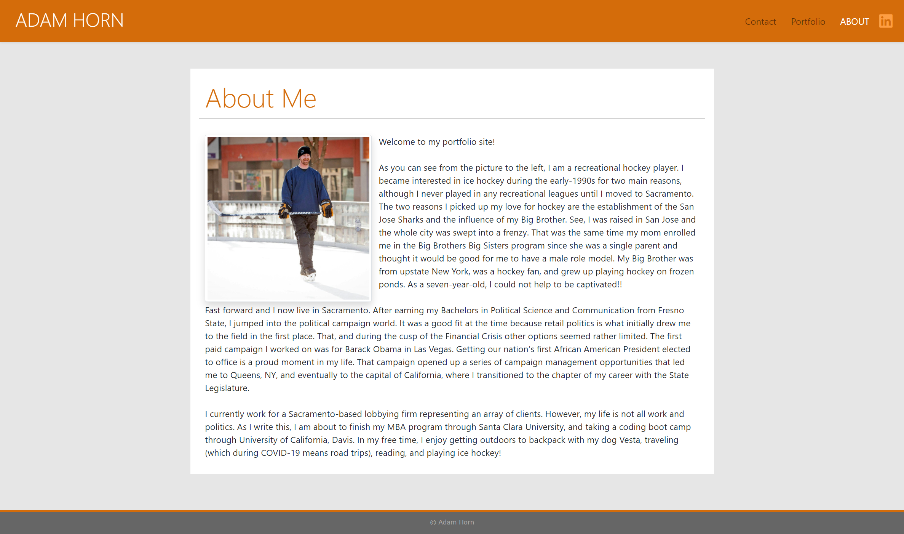

# Responsive Portfolio

## Description

This is a website built on Bootstrap to help improve my skills with responsive design elements. The site contains an About Me (Home) page, a Portfolio page with select images from my life, and a Contact page. On the About Me page, I have also included a link to my LinkedIn page for more information about me. 

## Screenshot of Home Page

## Link to Live Site

[Responsive Portfolio Site](https://mradamhorn.github.io/responsive-portfolio/)